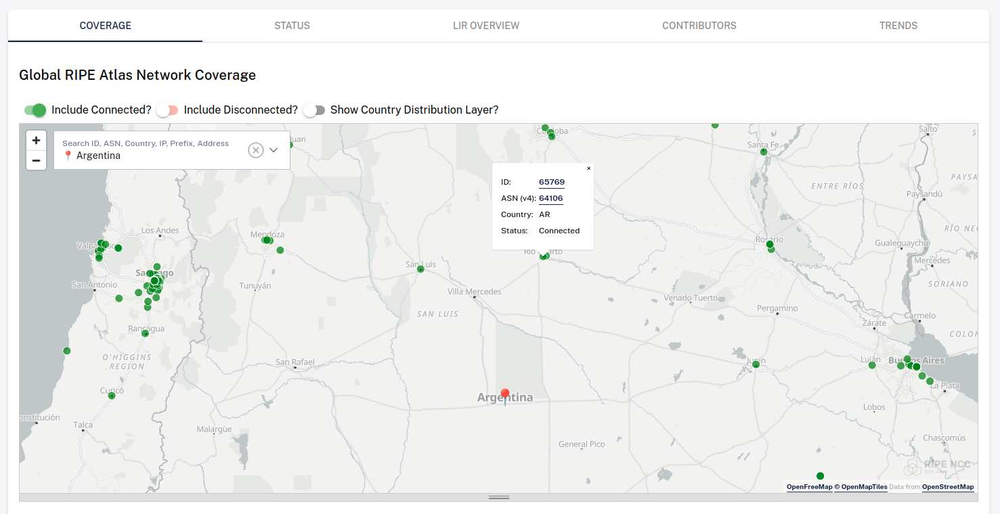
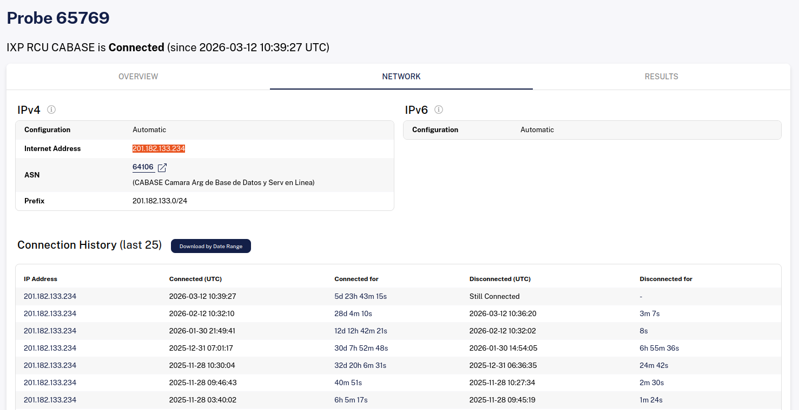
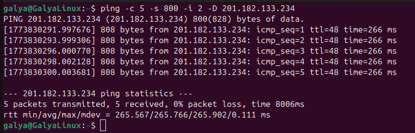
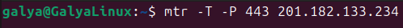
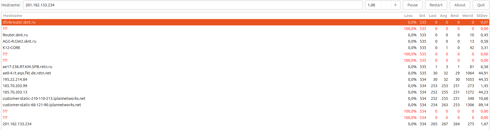
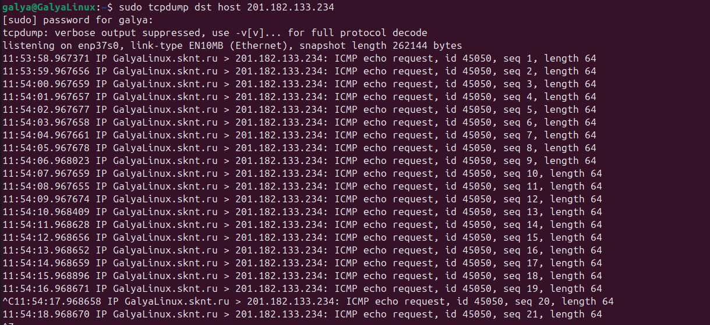
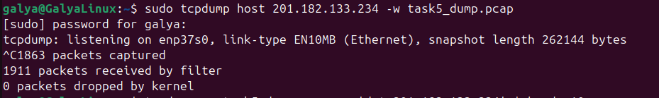
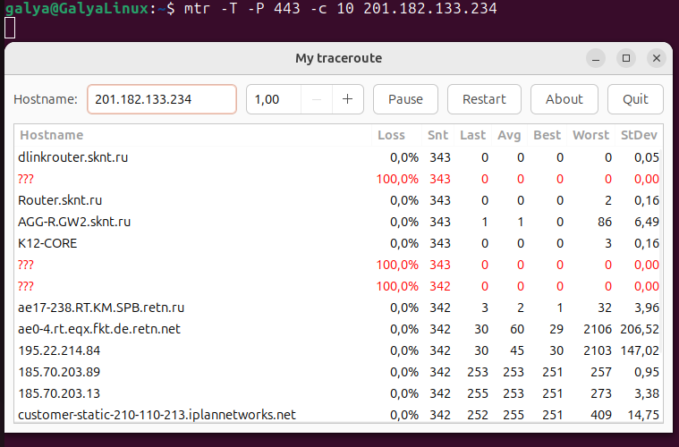

1. На сайте https://atlas.ripe.net/results/maps/network-coverage нашла доступный адрес в Аргентине: 201.182.133.234.

**Адрес на карте**

**Детализированный адрес** 

2. На адрес 201.182.133.234 отправила 5 пакетов размером 800 байтов с интервалом в 2 секунды и отображением времени отправки.

**Скриншот с вызовом команды `ping -c 5 -s 800 -i 2 -D 201.182.133.234`

3. **Выполнила трассировку до адреса 201.182.133.234, используя mtr. Указала протокол TCP порт 443: `mtr -T -P 443 201.182.133.234`**

Сегмент пересечения океана: между хопами Санкт-Петербурга (ae17-238.RT.KM.SPB.retn.ru) и Франкфуртом (ae0-4.rt.eqx.fkt.de.retn.net).
Регионы транзита: Россия (Санкт-Петербург) → Германия (Франкфурт) → Атлантический океан → Аргентина.

4. С помощью tcpdump сняла дамп трафика. Отфильтровала пакеты только до этого адреса, чтобы не попадало ничего лишнего.

**Скриншот команды `sudo tcpdump dst host 201.182.133.234`**

5. Для анализа я повторила трассировку с помощью mtr и одновременно захватила трафик в файл task5_dump.pcap, используя tcpdump.

**Скриншот команды `sudo tcpdump host 201.182.133.234 -w task5_dump.pcap`**

**Скриншот повтора трассировки mtr -T -P 443 -c 10 201.182.133.234`**

Результат анализа:
- От промежуточных маршрутизаторов приходили ICMP-сообщения **time exceeded**. Например, от адреса `185.70.203.99` (соответствует одному из хопов в трассировке).
- Ответа от самой цели (`201.182.133.234`) не получено – вероятно, зонд не отвечает на TCP-запросы порта 443, что нормально для RIPE Atlas.
- В запросах TTL = 64, а ответы приходят только от транзитных маршрутизаторов (ICMP time exceeded), подтверждая путь, построенный mtr.

